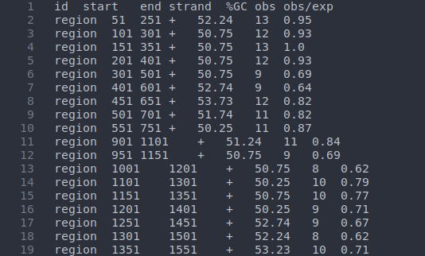

# CpG_island_identificator_julia
CpG island identification using the Gardiner-Garden and Frommer (1987) method that exports the results in a txt file containing the id, start, end, strand, gc content and obs/exp ratio   

## Dependences
julia v1.6.6 or later and the julia packages:
1. ArgParse
2. FASTX
3. BioSequences

## Example usage
scan input single or multi fasta file for CpG islands with window 200 bp step size 50 bp %GC content equal or greater that 55 and observed/expected ration equal or greater than 1.0
`julia cpg_island_calculator.jl --in input.fasta --win 200 --step 50 --gc 55 --ratio 1.0 --out output.txt`  

The output txt file with look like:

